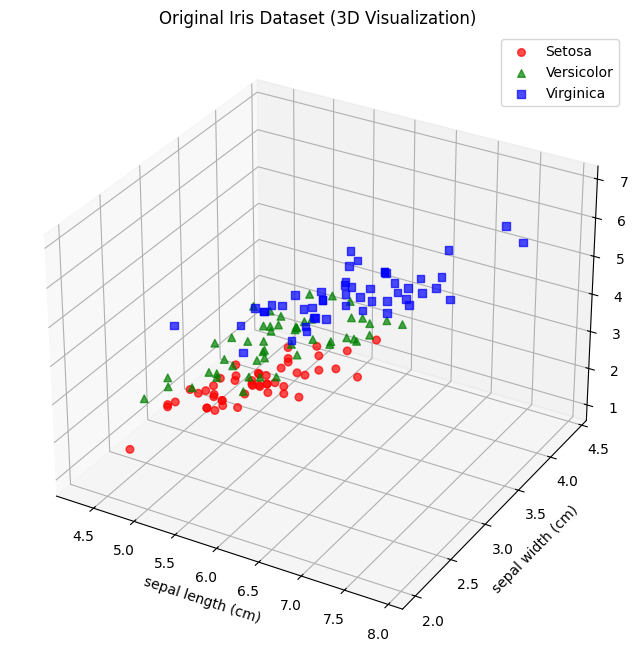
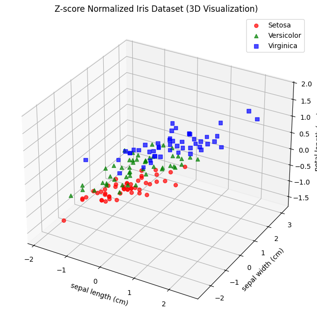
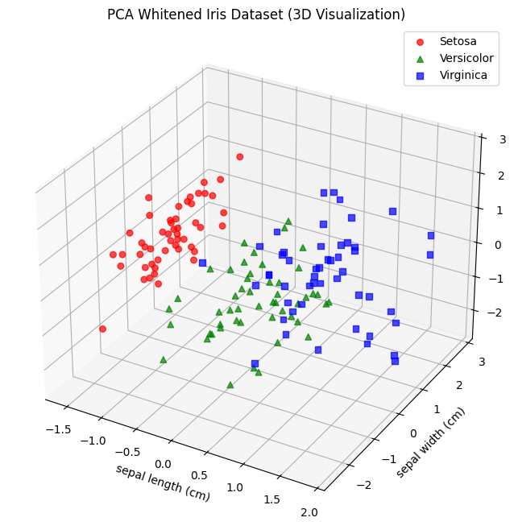
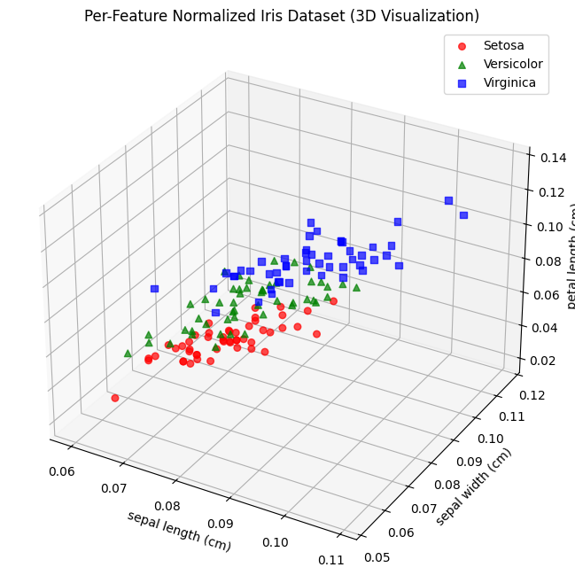
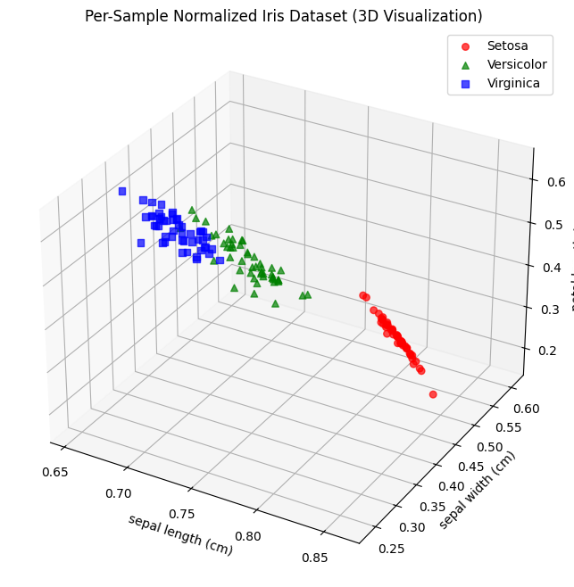
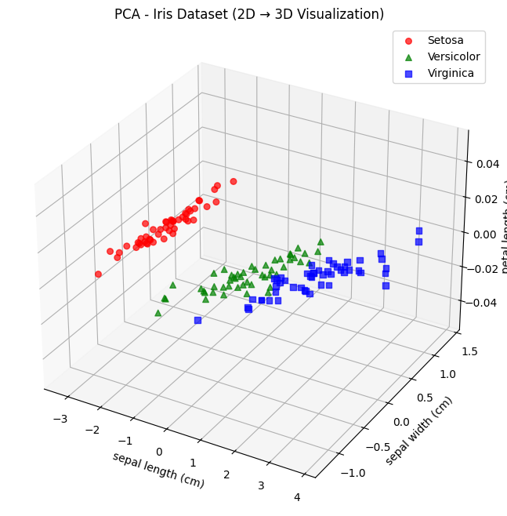
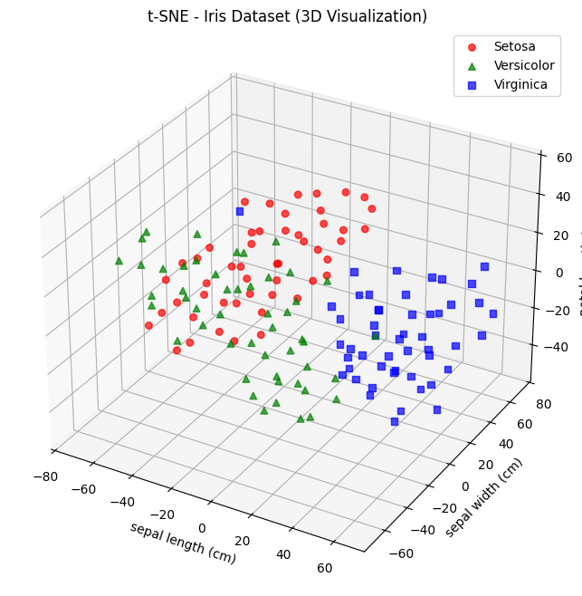
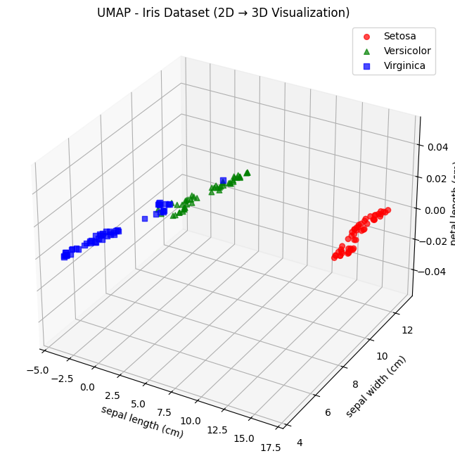
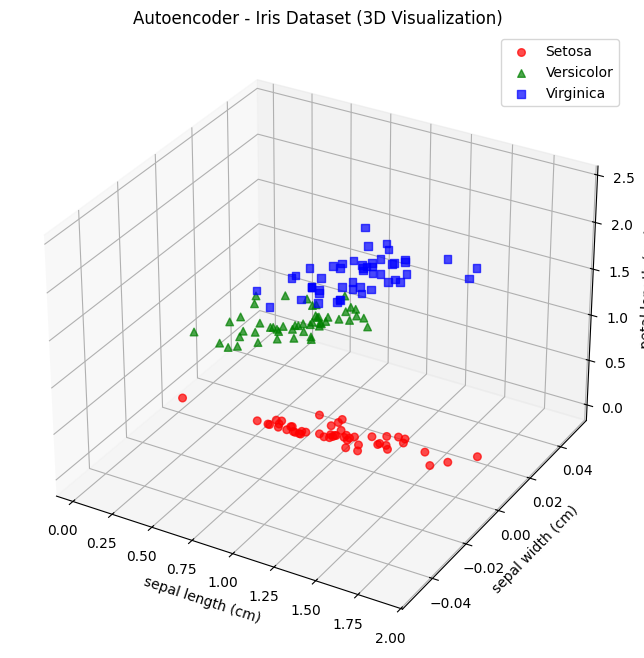
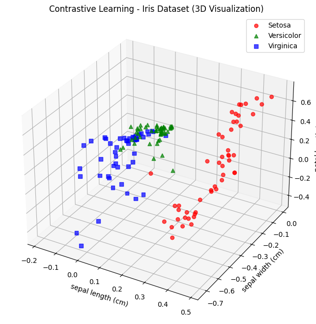

# 10944 Seminar

## The effect of normilization on dimensionality reduction

## Setting Up the Development Environment
1. Open the project in VS Code.
2. Install the Remote - Containers extension if prompted.
3. Install Docker
4. Reopen the project in the container by selecting "Reopen in Container" from the command palette.

## Running Each Normalization Script
To run the original visualization script:
  ```
  uv run ./scripts/1-1-original_visualization.py
  ```



To run the Z-score normalization script:
  ```
  uv run ./scripts/1-2-zscore_normalization.py
  ```




To run the Min-Max normalization script:
  ```
  uv run ./scripts/1-3-minmax_normalization.py
  ```


To run the PCA whitening script:
  ```
  uv run ./scripts/1-4-pca_whitening.py
  ```



To run the per-sample normalization script:
  ```
  uv run scripts/1-5-sample_normalization.py
  ```



To run the per-feature normalization script:
  ```
  uv run scripts/1-6-feature_normalization.py
  ```



------

## Dimensionality Reduction Techniques

To run the PCA dimensionality reduction script:
```
uv run ./scripts/2-1-pca_reduction.py
```



To run the t-SNE dimensionality reduction script:
```
uv run ./scripts/2-2-tsne_reduction.py
```



To run the UMAP dimensionality reduction script:
```
uv run ./scripts/2-3-umap_reduction.py
```



To run the Autoencoder dimensionality reduction script:
```
uv run ./scripts/2-4-autoencoder_reduction.py
```



To run the Contrastive Learning dimensionality reduction script:
```
uv run ./scripts/2-5-contrastive_reduction.py
```



To run the Parametric t-SNE dimensionality reduction script:
```
uv run ./scripts/2-6-parametric_tsne_reduction.py
```
