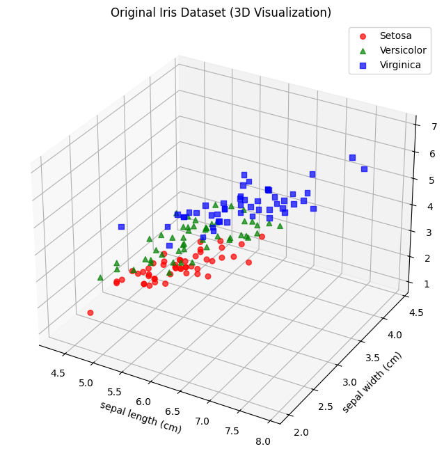
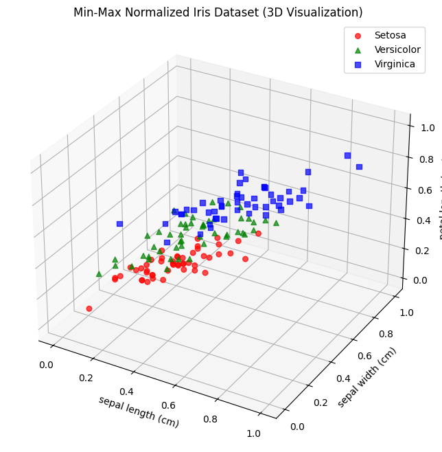
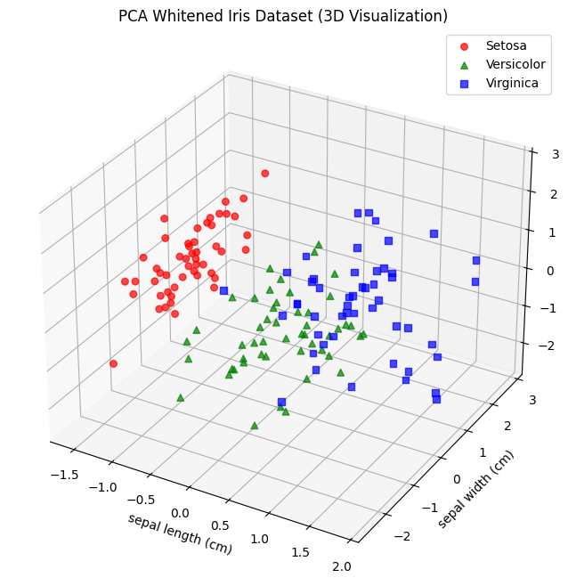
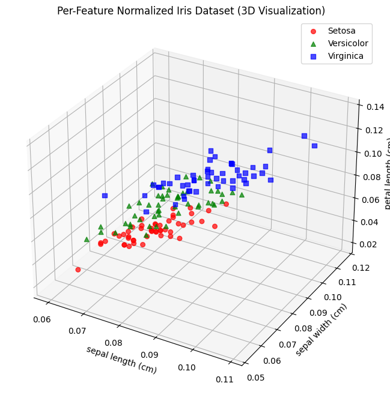

# 10944 Seminar

## The effect of normilization on dimensionality reduction

## Setting Up the Development Environment
1. Open the project in VS Code.
2. Install the Remote - Containers extension if prompted.
3. Install Docker
4. Reopen the project in the container by selecting "Reopen in Container" from the command palette.

## Running Each Normalization Script
To run the original visualization script:
  ```
  uv run ./scripts/1-original_visualization.py
  ```



To run the Z-score normalization script:
  ```
  uv run ./scripts/2-zscore_normalization.py
  ```


To run the Min-Max normalization script:
  ```
  uv run ./scripts/3-minmax_normalization.py
  ```



To run the PCA whitening script:
  ```
  uv run ./scripts/4-pca_whitening.py
  ```



To run the per-sample normalization script:
  ```
  uv run scripts/5-1-sample_normalization.py
  ```



To run the per-feature normalization script:
  ```
  uv run scripts/5-2-feature_normalization.py
  ```

