# 10944 Seminar

## The effect of normalization on dimensionality reduction

## Setting Up the Development Environment
1. Open the project in VS Code.
2. Install the Remote - Containers extension if prompted.
3. Install Docker
4. Reopen the project in the container by selecting "Reopen in Container" from the command palette.

## Project Visualizations

### 1. Normalization Techniques

| Technique | Visualization |
|-----------|---------------|
| Original Data |  |
| Z-Score Normalization |  |
| Min-Max Normalization |  |
| Per-Sample Normalization |  |
| Per-Feature Normalization |  |

### 2. Dimensionality Reduction Techniques

| Technique | 2D Visualization | 3D Visualization |
|-----------|------------------|------------------|
| PCA |  |  |
| t-SNE |  |  |
| UMAP |  | - |
| Autoencoder |  | - |
| Contrastive Learning | 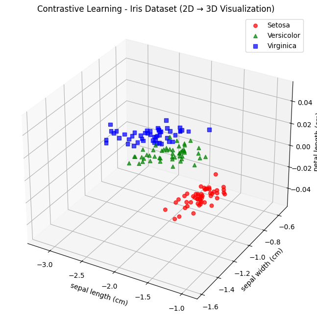 | - |
| Parametric t-SNE | 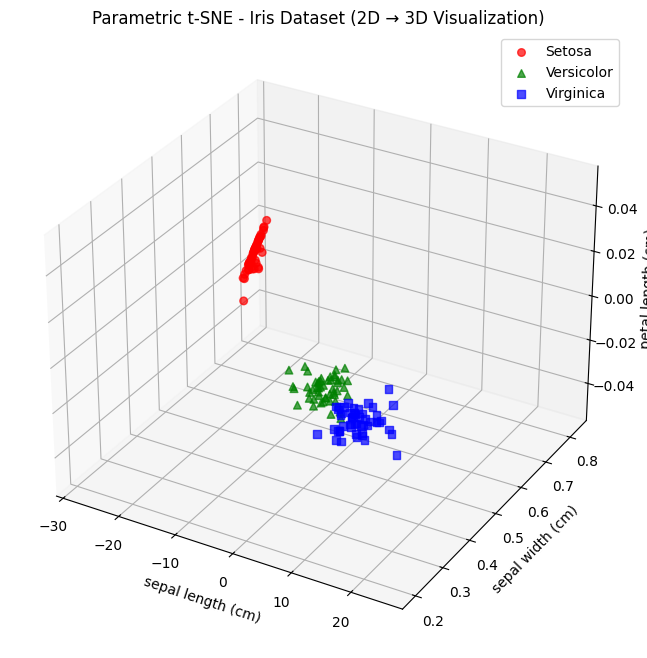 | - |

### 3. Wine Dataset: Combined Normalization and Dimensionality Reduction 

#### 3.1 Raw vs Z-Score PCA
| Processing | 2D | 3D |
|------------|-----|-----|
| Raw PCA |  |  |
| Z-Score PCA |  |  |

#### 3.2 Raw vs Z-Score with PCA and t-SNE
| Processing | PCA 2D | PCA 3D | t-SNE 2D | t-SNE 3D |
|------------|--------|--------|----------|----------|
| Raw |  |  |  |  |
| Z-Score |  |  |  |  |

#### 3.3 Raw vs Z-Score with PCA and UMAP
| Processing | PCA 2D | PCA 3D | UMAP 2D | UMAP 3D |
|------------|--------|--------|---------|---------|
| Raw |  |  |  |  |
| Z-Score |  |  |  |  |

#### 3.4 Min-Max Normalization
| Technique | Visualization |
|-----------|---------------|
| Min-Max PCA |  |
| Min-Max t-SNE |  |

### 4. Autoencoder Experiments

#### 4.1 MinMax Normalized Autoencoders with LeakyReLU(0.3) and Sigmoid

| Loss Function | Model Visualization | Loss Plot | Sample Reconstruction |
|---------------|---------------------|-----------|----------------------|
| BCE |  |  |  |
| MSE |  |  | 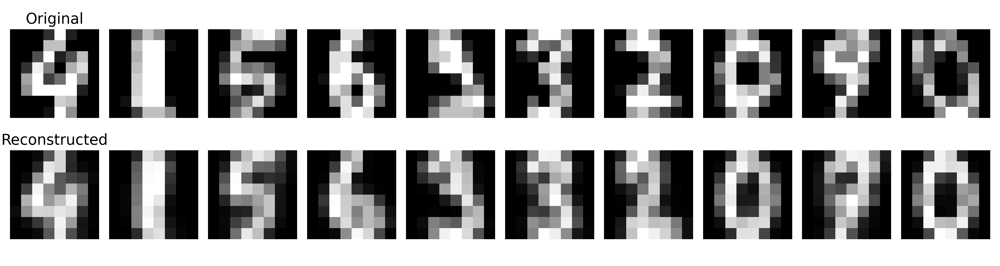 |

#### 4.2 MinMax Normalized Autoencoders with ReLU and Sigmoid

| Loss Function | Model Visualization | Loss Plot | Sample Reconstruction |
|---------------|---------------------|-----------|----------------------|
| BCE |  |  |  |
| MSE |  | 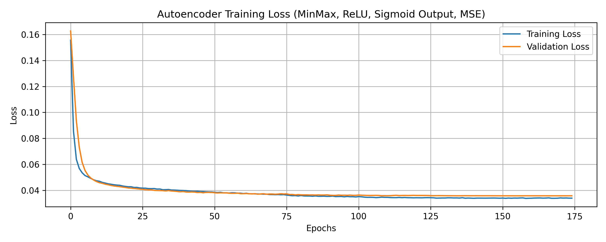 |  |

#### 4.3 Z-Score Normalized Autoencoders with LeakyReLU(0.3) and Linear Activation

| Loss Function | Model Visualization | Loss Plot | Sample Reconstruction |
|---------------|---------------------|-----------|----------------------|
| BCE |  |  | 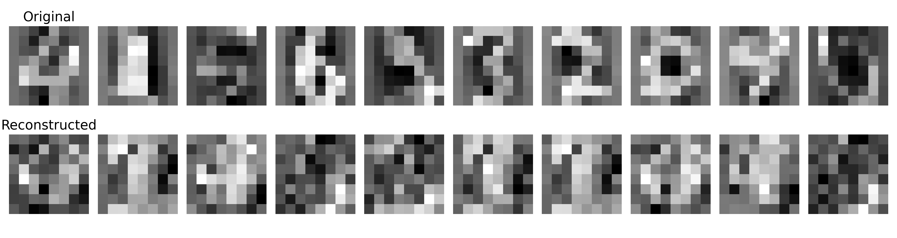 |
| MSE |  |  | 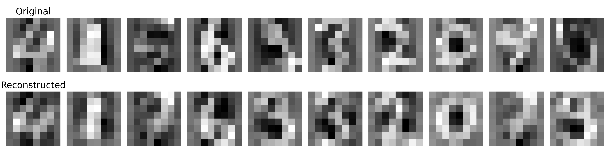 |

#### 4.4 Z-Score Normalized Autoencoders with ReLU and Linear Activation

| Loss Function | Model Visualization | Loss Plot | Sample Reconstruction |
|---------------|---------------------|-----------|----------------------|
| BCE | 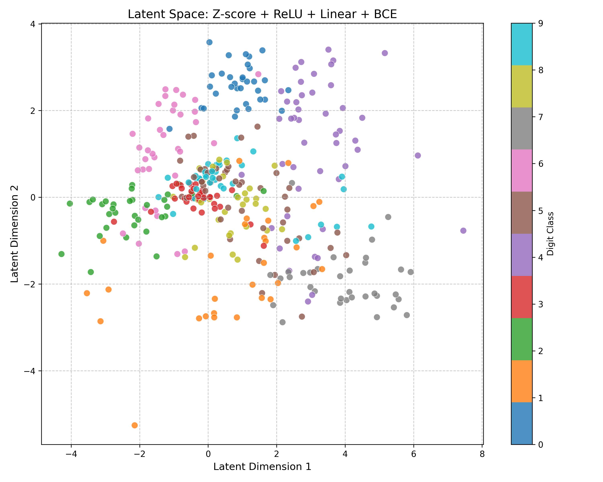 | 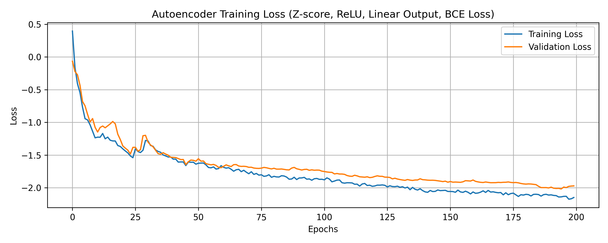 | 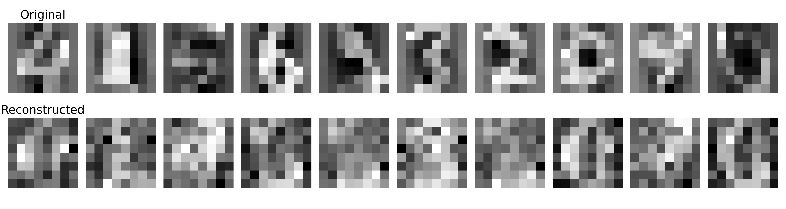 |
| MSE | 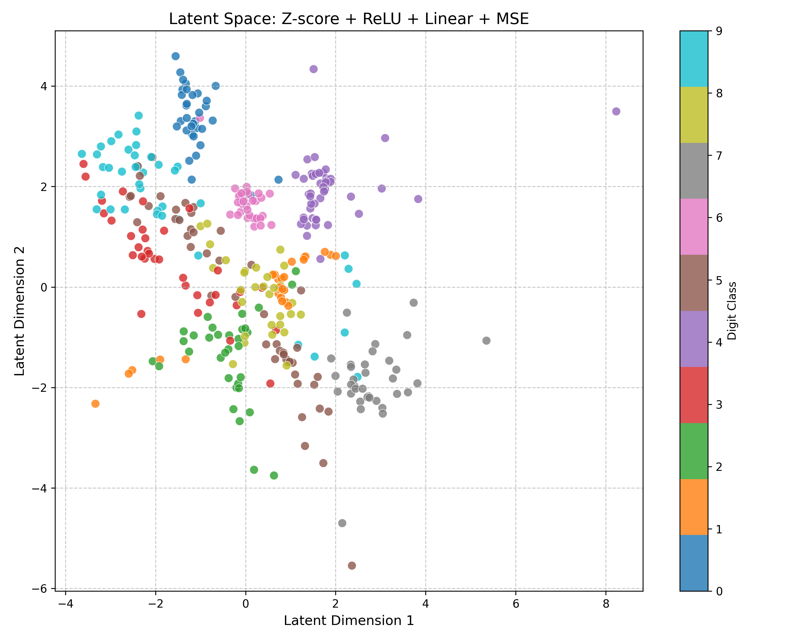 |  | 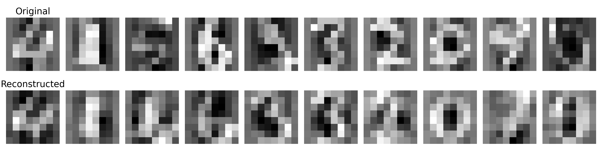 |
